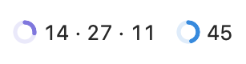
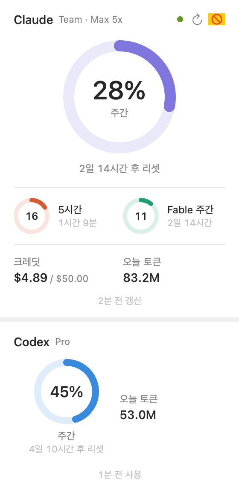
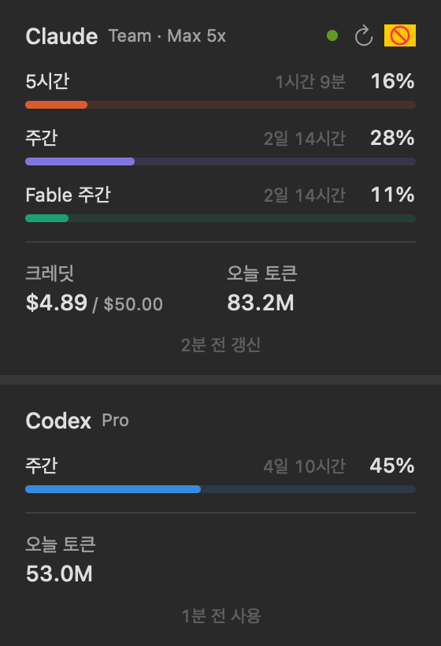

# Claude Usage Bar (macOS)

Claude Code 구독 플랜 사용량을 메뉴바에 보여 주는 macOS 앱입니다. Codex(앱·CLI)를 쓰면 Codex 사용량도 함께 보여 줍니다.
이 저장소의 Windows 위젯과 같은 정보를 보여 주는 macOS 버전입니다. Windows 코드를 옮긴 게 아니라, 같은 동작을 Swift/SwiftUI로 새로 구현했습니다.

  

 

## 요구 사항

- macOS 14 이상
- Claude Code CLI에 구독 계정(Pro / Max / Team / Enterprise)으로 로그인한 적이 있을 것

## 빌드 / 실행

```bash
scripts/build-app.sh --run      # ~/Applications/ClaudeUsageBar.app 생성 후 실행
swift test                      # 단위 테스트
.build/debug/ClaudeUsageBar --snapshot out/   # 실제 데이터로 패널·메뉴바 PNG 생성
```

## 데이터 출처

| 우선순위 | 출처 | 조건 | 얻는 것 |
|---|---|---|---|
| 1 | `GET api.anthropic.com/api/oauth/usage` (비공식) | CLI 토큰이 유효할 때, 기본 3분 주기 | 리셋 시각, 모델별 한도, 크레딧 금액까지 전부 |
| 2 | 데스크톱 앱 기록 `~/Library/Application Support/Claude/plan-usage-history.json` | 토큰이 만료됐고 기록이 30분 안일 때 | 5시간·주간 % (15분 단위) |
| — | `~/.claude/projects/**/*.jsonl` | 항상, 10초 주기 | 오늘 토큰 |
| Codex | `~/.codex/sessions/**/rollout-*.jsonl`의 `token_count` 이벤트 | Codex를 쓸 때마다 CLI가 기록, 한도는 30초·토큰은 10초 주기로 확인 | Codex 한도별 5시간·주간 %, 리셋 시각, 오늘 토큰 |

- 토큰은 키체인 `Claude Code-credentials`에서 `/usr/bin/security`로 **읽기만** 합니다. 앱이 토큰을 갱신하거나 다시 쓰지 않습니다. 토큰이 만료되면 터미널에서 `claude`를 실행할 때 CLI가 스스로 갱신합니다.
- 429를 받으면 5 → 10 → 20 → 30분으로 대기 시간을 늘리고, 앱을 다시 켜도 대기를 이어받습니다.
- 토큰은 디스크·로그에 남기지 않습니다(로그에서 `sk-ant-…`는 마스킹).
- Codex는 로컬 로그만 읽고 네트워크·인증을 쓰지 않습니다. ChatGPT 앱의 Codex, Codex CLI, VS Code 확장이 모두 같은 로그를 남깁니다
  - 한도 %는 Codex 서버가 알려 준 계정 전체 값이라, 어느 클라이언트에서 썼든 가장 최근 기록 하나를 씁니다(더하지 않음). 오늘 토큰은 이 맥의 모든 세션을 합산합니다
  - 기본 한도는 오래 안 써도 계속 보이고, 리셋이 지났으면 0%(추정)로 표시합니다. 모델별 추가 한도는 8일 동안 기록이 없으면 숨깁니다
  - 마지막 기록이 6시간보다 오래되면 회색(웹·다른 기기 사용분은 이 맥에서 다음에 쓸 때 반영)
- Claude CLI 토큰이 만료되면(약 8시간, 터미널에서 `claude`를 쓸 때만 갱신) 데스크톱 앱 기록으로 표시합니다(데스크톱 앱은 켜져 있어도 기록을 드문드문 남깁니다). 설정의 "CLI 토큰 자동 갱신"(기본 꺼짐)을 켜면 앱이 CLI를 짧게 실행해 CLI가 스스로 갱신합니다(갱신마다 약 500토큰). 주간 리셋은 7일 주기로 계산하고, 5시간 리셋은 기록으로 추정해 "약"을 붙입니다. 지난 리셋은 0%(추정)
- API 키만 쓰는 사용자(구독 없음)는 5시간·주간 한도가 없어서 오늘 토큰만 보여 줍니다(Claude·Codex 모두)

## 기능

- 메뉴바 항목 하나에 켜진 서비스를 이어서 표시: `◔ 13 · 27 · 11  ◔ 45` (Claude · Codex)
  - Claude 조각은 형식 4종(① 도넛만 / ② 도넛 + 숫자 / ③ 미니 도넛 3개 / ④ 도넛 + 숫자 3개, 기본 ④), Codex 조각은 도넛 + 가장 높은 %
  - ③·④가 노치 뒤로 가려지면 ②로 자동 축소
- 패널: 서비스마다 섹션(Claude 위, Codex 아래, 사이에 띠). 섹션 안에 한도 + 크레딧·오늘 토큰 + 상태 줄
  - 패널 크기: 기본(도넛) / 작게(한도별 가로 막대)
  - 도넛·막대를 누르면 남은 시간 ↔ 리셋 시각 전환
- 표시할 서비스: Claude / Codex 각각 켜고 끄기. 처음에는 `~/.claude`, `~/.codex/sessions`가 있는지로 자동 결정. Claude를 끄면 키체인·API에 접근하지 않음
- Codex 색은 파랑 한 가지(70%+ 주황, 90%+ 빨강)
- 알림: 경고(85%) · 위험(95%) · 100% 도달 · 사용 속도 예측(60분 안에 한도) · 추가 크레딧 사용. 리셋 주기마다 단계별 1회
- 설정(우클릭 또는 패널 ⋯ → 설정…): 표시할 서비스, 메뉴바 형식, 패널 크기, Claude 조회 주기(2/3/5/10분), 로그인 시 자동 실행, 알림 기준치(80·95 / 85·95 / 90·98), 알림 테스트

## 앱 데이터

`~/Library/Application Support/ClaudeUsageBar/`: `state.json`(마지막 API 값·대기 상태), `alerts.json`(알림 기록), `app.log`(최근 200줄)

## 문서

- [docs/GUIDE.md](docs/GUIDE.md): 설치·사용·문제 해결 가이드
- [CLAUDE.md](CLAUDE.md): Claude Code로 빌드·수정할 때 참고하는 안내
